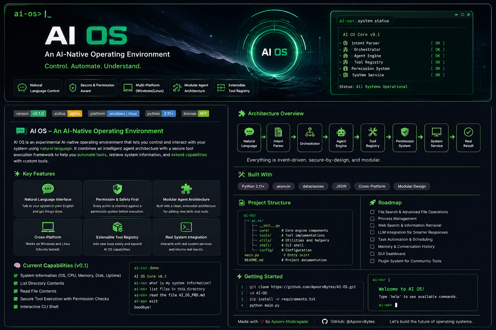

<div align="center">



<br>

# AI OS

### An AI-Native Operating Environment

**Control your computer through natural language — securely, modularly, and transparently.**

[](https://www.python.org/)
[]()
[]()
[]()
[]()

<br>

[Getting Started](#-getting-started) •
[Architecture](#-architecture) •
[Features](#-current-features) •
[Testing](#-testing) •
[Roadmap](#-roadmap)

</div>

---

## 🧠 Overview

**AI OS** is an experimental AI-native operating environment designed to make artificial intelligence a first-class interface for interacting with a computer.

Instead of manually navigating applications, files, and system functions, users can express what they want in natural language. AI OS interprets the request, routes it through a controlled execution pipeline, validates permissions, selects registered tools, and returns a transparent result.

> **AI OS is currently a core prototype, not a complete operating system.**

The long-term goal is to build a Linux-based, AI-native computing environment with intelligent agents, persistent memory, automation, plugins, and a native desktop experience.

---

## ⚡ Current Features

### 💬 Natural Language Interface

Interact with the system using simple commands.

```text
ai-os> show me my system information
🧠 Intent Parsing

User requests are interpreted and converted into structured intents.

User Request
     ↓
Intent Parser
     ↓
Structured Intent
🤖 Agent Engine

The Agent Engine coordinates tools and system services to execute tasks.

The architecture is designed so that AI actions follow controlled execution paths rather than giving an AI model unrestricted access to the operating system.

🧩 Tool Registry

System capabilities are exposed through an explicit tool registry.

This allows AI OS to:

Register available capabilities
Validate tool requests
Control which tools agents can access
Expand functionality modularly
Avoid arbitrary execution paths
🔐 Permission System

Sensitive or high-risk actions can be controlled through permission policies.

AI Request
    ↓
Tool Selected
    ↓
Permission Check
    ↓
Allowed / Blocked
    ↓
Controlled Execution
🖥️ Real System Integration

AI OS can interact with real system services.

Currently implemented:

Operating system detection
Hostname detection
System architecture detection
Processor information when available

Example:

AI OS:
SystemInfo(
    operating_system='Linux',
    hostname='ai-os-dev',
    architecture='x86_64',
    processor=''
)
🌍 Cross-Platform Validation

The AI OS Core v0.1 has been tested successfully on:

Platform	Status
🪟 Windows	✅ Passed
🐧 Ubuntu Linux	✅ Passed

Ubuntu testing is performed inside a VMware virtual machine.

🏗️ Architecture

AI OS processes requests through a controlled execution pipeline:

┌─────────────────────────────┐
│   Natural Language Request  │
└──────────────┬──────────────┘
               │
               ▼
┌─────────────────────────────┐
│        Intent Parser        │
└──────────────┬──────────────┘
               │
               ▼
┌─────────────────────────────┐
│        Orchestrator         │
└──────────────┬──────────────┘
               │
               ▼
┌─────────────────────────────┐
│        Agent Engine         │
└──────────────┬──────────────┘
               │
               ▼
┌─────────────────────────────┐
│      Permission System      │
└──────────────┬──────────────┘
               │
               ▼
┌─────────────────────────────┐
│        Tool Registry        │
└──────────────┬──────────────┘
               │
               ▼
┌─────────────────────────────┐
│       System Services       │
└──────────────┬──────────────┘
               │
               ▼
          Real OS Result
📁 Project Structure
AI-OS/
│
├── ai_core/
│   ├── __init__.py
│   ├── model.py
│   ├── intent.py
│   ├── tool_registry.py
│   ├── test_model.py
│   ├── test_intent.py
│   └── test_tool_registry.py
│
├── agent_engine/
│   ├── __init__.py
│   ├── agent.py
│   ├── orchestrator.py
│   ├── test_agent.py
│   └── test_orchestrator.py
│
├── system_services/
│   ├── __init__.py
│   ├── system_info.py
│   ├── permissions.py
│   ├── test_system_info.py
│   └── test_permissions.py
│
├── backend/
│   ├── __init__.py
│   └── cli.py
│
├── automation/
│   └── Future automation engine
│
├── desktop_shell/
│   └── Future AI-native desktop environment
│
├── memory_engine/
│   └── Future memory system
│
├── plugin_sdk/
│   └── Future extension framework
│
├── installer/
│   └── Future installation and deployment tools
│
├── docs/
│   └── PRD.md
│
├── scripts/
├── tests/
│
├── assets/
│   └── ai-os-banner.png
│
└── README.md
🚀 Getting Started
Requirements

Before running AI OS, install:

Python 3.11 or later
Git
Clone the Repository
git clone https://github.com/ApoorvBytes/AI-OS.git
cd AI-OS
▶️ Run AI OS
Windows
python -m backend.cli
Linux
python3 -m backend.cli

You should see:

==================================================
                 AI OS
            Core Prototype v0.1
==================================================

Type a command or type 'exit' to quit.

Try:

ai-os> show me my system information

Example response:

AI OS:
SystemInfo(
    operating_system='Linux',
    hostname='ai-os-dev',
    architecture='x86_64'
)

Exit with:

ai-os> exit
🧪 Testing

The current core prototype includes tests for the major execution pipeline.

Windows

Run:

python -m ai_core.test_model
python -m ai_core.test_tool_registry
python -m system_services.test_system_info
python -m system_services.test_permissions
python -m ai_core.test_intent
python -m agent_engine.test_agent
python -m agent_engine.test_orchestrator
Linux

Run:

python3 -m ai_core.test_model
python3 -m ai_core.test_tool_registry
python3 -m system_services.test_system_info
python3 -m system_services.test_permissions
python3 -m ai_core.test_intent
python3 -m agent_engine.test_agent
python3 -m agent_engine.test_orchestrator
Current Test Status
AI Core                 ✅
Tool Registry           ✅
System Information      ✅
Permission System       ✅
Intent Parser           ✅
Agent Engine            ✅
Orchestrator            ✅
Interactive CLI         ✅
Windows Validation      ✅
Ubuntu Validation       ✅
🔐 Security Philosophy

AI OS is built around one important principle:

AI should not automatically receive unrestricted access to the operating system.

The intended execution model is:

1. Understand the user request
2. Determine the intended capability
3. Select a registered tool
4. Validate the request
5. Apply permission policies
6. Execute through a controlled system service
7. Return a transparent result

The architecture is designed to grow toward:

Explicit user approval
Permission-gated execution
Audit logging
Capability isolation
Credential protection
Sandboxed operations
Recoverable system actions
🛣️ Roadmap
v0.1 — Core Prototype ✅
 Modular project architecture
 AI Core
 Intent parsing
 Tool registry
 Permission system
 Agent Engine
 Orchestrator
 Interactive CLI
 Real system information tool
 Windows validation
 Ubuntu validation
v0.2 — Workspace Intelligence 🚧
 Safe file search
 Safe file reading
 Workspace boundaries
 Path validation
 File capability tests
v0.3 — AI Integration
 Local LLM support
 Cloud AI support
 Model routing
 Context management
 Improved natural-language understanding
v0.4 — Memory & Agents
 Conversation memory
 Persistent project memory
 Multi-step task planning
 Improved agent workflows
Future Vision
 Automation engine
 Plugin SDK
 AI-native desktop shell
 Process management
 Advanced file operations
 Enterprise controls
 Bootable Linux-based AI OS
🛠️ Technology
Area	Technology
Core Language	Python
Version Control	Git
Repository Hosting	GitHub
Development Environment	Windows
Linux Environment	Ubuntu 26.04
Virtualization	VMware
Interface	Command Line
Architecture	Modular Agent-Based
🎯 Vision

The goal of AI OS is not simply to add a chatbot to an existing operating system.

The long-term objective is to explore a computing environment where AI becomes a controlled, secure, and intelligent interface between humans and computer systems.

Traditional Computing
User
  ↓
Applications
  ↓
Operating System
AI OS
User
  ↓
Natural Language
  ↓
AI Understanding
  ↓
Controlled Agents
  ↓
Registered Tools
  ↓
Permission System
  ↓
Operating System

The AI layer should help users:

Understand their system
Search information
Automate repetitive tasks
Execute approved operations
Manage projects and files
Interact with software through natural language

All while maintaining explicit boundaries and human control.

🤝 Contributing

AI OS is an evolving experimental project.

Contributions, ideas, and feedback are welcome, especially in:

AI agent architecture
Operating system design
System security
Linux systems programming
Local LLM integration
Tool sandboxing
Automation systems
Desktop environments

For significant changes, open an issue first to discuss the proposed approach.

⚠️ Disclaimer

AI OS is currently an early development prototype.

It is not yet a production-ready operating system and should not be relied upon for critical infrastructure or destructive system operations.

The current focus is on building a secure, modular, and extensible foundation before adding increasingly powerful capabilities.

<div align="center">
⭐ Support the Project

If you find AI OS interesting, consider giving the repository a star.

Building toward a future where computers understand intent — not just commands.

<br>

Made by Apoorv Khobragade

GitHub Profile • AI OS Repository

</div> ```